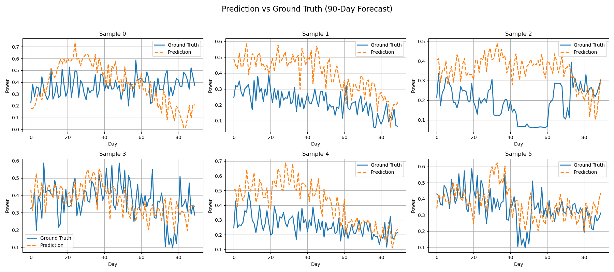

# Family Power Prediction

This repository contains code for predicting family power using machine learning techniques.


## LSTM

train

```python
python main.py -t -m lstm
```

evaluate

```python
python main.py -m lstm -l results/lstm-90-90-512-1-0.03.pth
```

or run test for task 1 in 90 days and 365 days
```python
python test.py
```

results
90 days for 5 per experiment results

```text
Task 1 (90 days) results: MSE = 0.0027 ± 0.0001, MAE = 0.0404 ± 0.0005
```

loss


Ground truth and prediction


365 days for 5 per experiment results

```text
Task 1 (365 days) results: MSE = 0.0037 ± 0.0001, MAE = 0.0475 ± 0.0005
```

loss


Ground truth and prediction


## Transformer

train

```python
python main.py -t -m transformer
```

evaluate

```python
python main.py -m transformer -l results/transformer-90-90-256-1-128-4-0.029.pth
```

or run test for task 1 in 90 days and 365 days

```python
python test.py
```

results
90 days for 5 per experiment results

```text
Task 2 (90 days) results: MSE = 0.0045 ± 0.0001, MAE = 0.0523 ± 0.0006
```

loss


Ground truth and prediction


365 days for 5 per experiment results
```text
Task 2 (365 days) results: MSE = 0.0068 ± 0.0000, MAE = 0.0645 ± 0.0002
```

loss


Ground truth and prediction


## CTSAN

run test for task 1 in 90 days and 365 days

```python
python test.py
```

results
90 days for 5 per experiment results

```text
Task 3 (90 days) results: MSE = 0.0065 ± 0.0001, MAE = 0.0624 ± 0.0007
```

loss


Ground truth and prediction




365 days for 5 per experiment results
```text
Task 3 (365 days) results: MSE = 0.0080 ± 0.0001, MAE = 0.0702 ± 0.0003
```

loss


Ground truth and prediction


