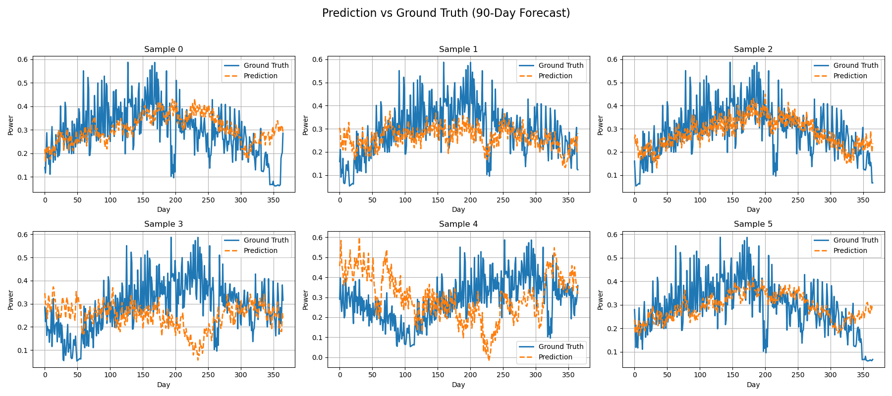
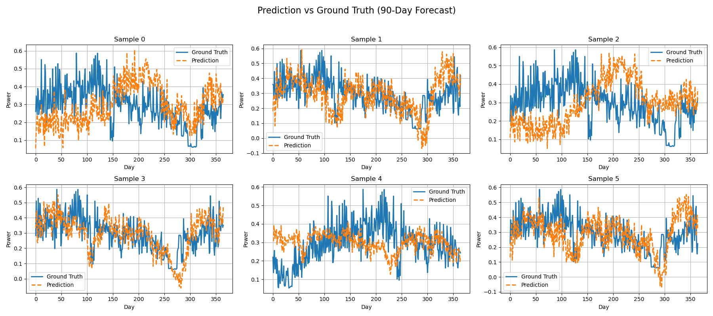
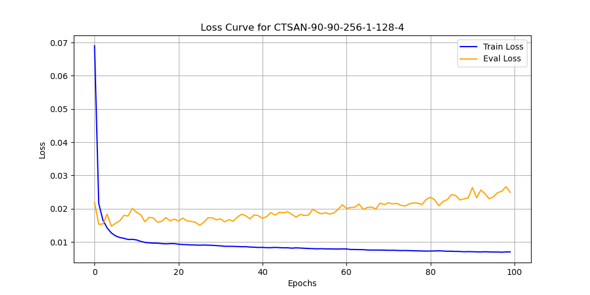

# Family Power Prediction

This repository contains code for predicting family power using machine learning techniques.


## LSTM

train

```python
python main.py -t -m lstm
```

evaluate

```python
python main.py -m lstm -l results/lstm-90-90-512-1-0.03.pth
```

or run test for task 1 in 90 days and 365 days
```python
python test.py
```

results
90 days for 5 per experiment results

```text
Task 1 (90 days) results: MSE = 0.0308 ± 0.0018, MAE = 0.1358 ± 0.0033
```

loss


Ground truth and prediction


365 days for 5 per experiment results

```text
Task 1 (365 days) results: MSE = 0.0182 ± 0.0003, MAE = 0.1057 ± 0.0011
```

loss


Ground truth and prediction



## Transformer

train

```python
python main.py -t -m transformer
```

evaluate

```python
python main.py -m transformer -l results/transformer-90-90-256-1-128-4-0.029.pth
```

or run test for task 1 in 90 days and 365 days

```python
python test.py
```

results
90 days for 5 per experiment results

```text
Task 2 (90 days) results: MSE = 0.0269 ± 0.0000, MAE = 0.1314 ± 0.0000
```

loss


Ground truth and prediction


365 days for 5 per experiment results
```text
Task 2 (365 days) results: MSE = 0.0204 ± 0.0006, MAE = 0.1124 ± 0.0018
```

loss


Ground truth and prediction




## CTSAN

run test for task 1 in 90 days and 365 days

```python
python test.py
```

results
90 days for 5 per experiment results

```text
Task 3 (90 days) results: MSE = 0.0215 ± 0.0031, MAE = 0.1172 ± 0.0089
```

loss



Ground truth and prediction


365 days for 5 per experiment results
```text
Task 3 (365 days) results: MSE = 0.0197 ± 0.0021, MAE = 0.1107 ± 0.0063
```

loss


Ground truth and prediction


